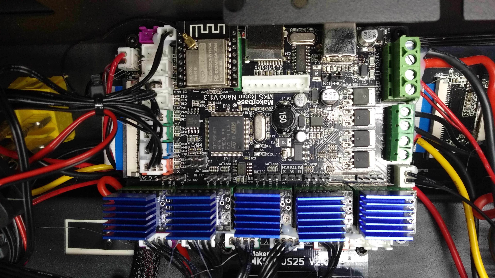
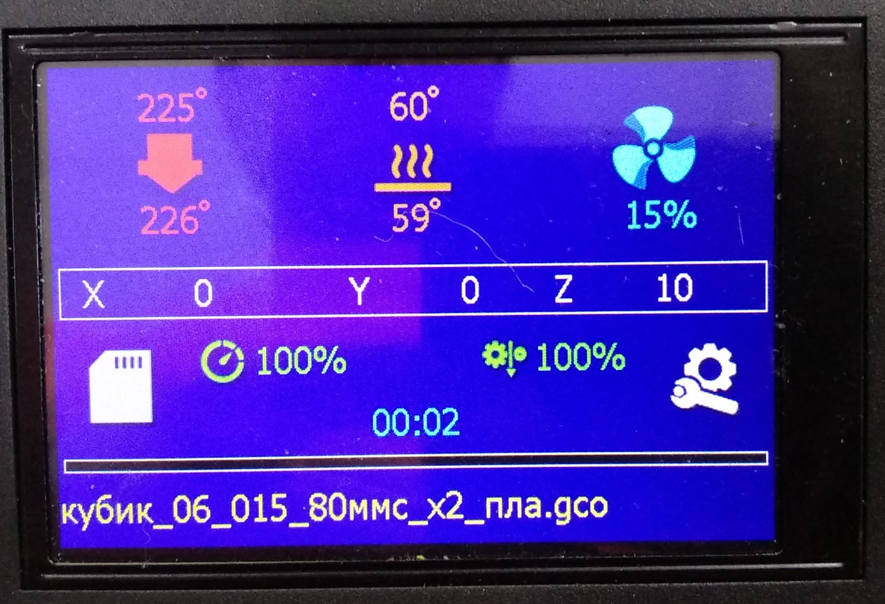

# Прошивка Marlin 3D Printer для принтера Flyingbear Reborn с платой MKS Robin Nano v1.3 (со съемными драйверами)
Основана на 

Плата, для которой предназначена эта прошивка:

## Главное
- исправлены все косяки вывода русскоязычных надписей
- поддержка русских имен файлов
- включена калибровка стола ("Выровнять стол" с ручной подгонкой высоты сопла по 9 точкам)
- включена подстройка винтами стола по 4 точкам, соответствующим положению регулировочных винтов ("Выровнять углы")
- активен датчик окончания филамента
- активирована альтернатива джеркам - Junction Deviation
- Linear Advance временно не активирован
- по умолчанию стоит ограничение на ускорения осей - 3000 мм/сек\*сек, скорость - 300 мм/сек
- интерфейс - стандартный графический

## История

### 19.10.2021
- создана базовая конфигурация
- исправлены все недоработки по работе со строками в формате UTF8 (в том числе русскоязычными)
- добавлены два шрифта Tahoma14 и Tahoma18 с кириллицей

