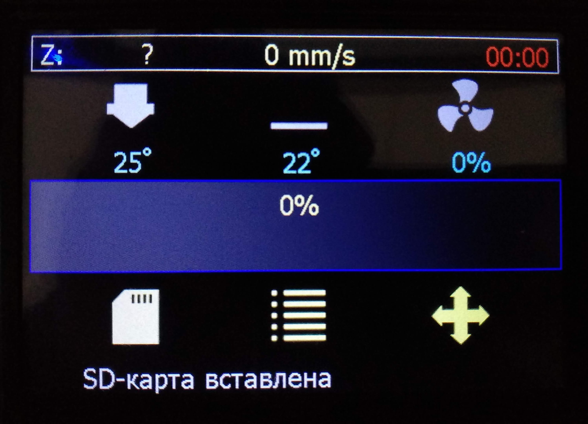
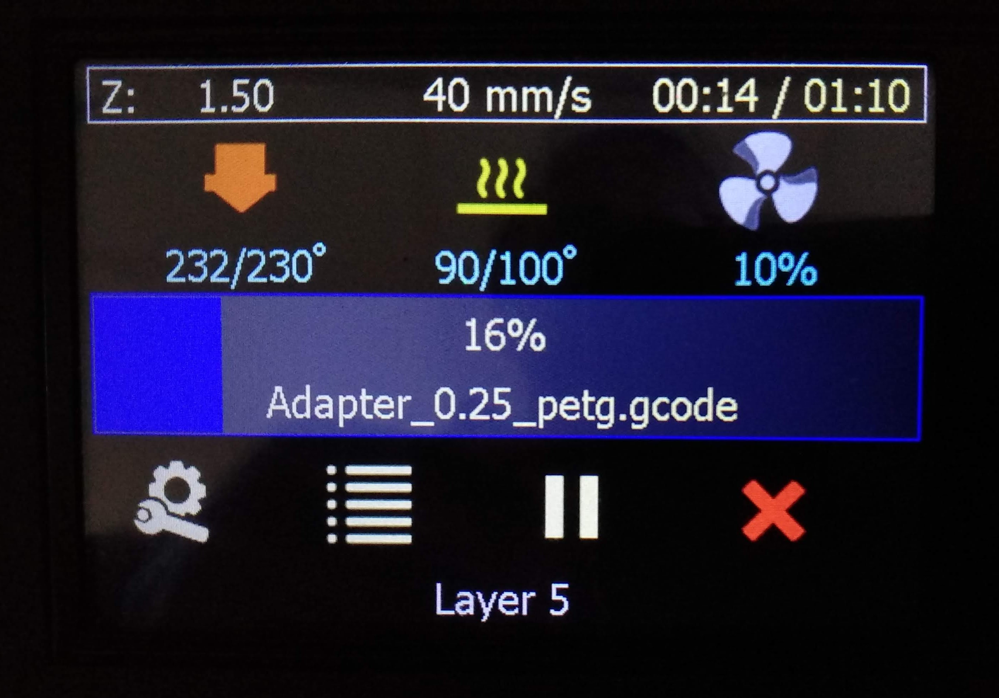

[English](#english-version)
## Прошивка MarlinRB для принтера Flyingbear Reborn с платами MKS Robin Nano v1.3 (съемные драйвера, контроллер STM32F407), MKS Robin Nano S v1.3 (несъемные драйвера, контроллер STM32F407) и MKS Robin Nano v1.2 (съемные драйвера, контроллер STM32F103). 

Основана на [Marlin 3D Printer Firmware](https://github.com/MarlinFirmware/Marlin)  версии 2.0.9.2

## Главное
Обновлено 26.11.2021
- исправлены все косяки вывода русскоязычных надписей
- поддержка русских имен файлов
- включена калибровка стола ("Выровнять стол" с ручной подгонкой высоты сопла по 9 точкам)
- включена подстройка винтами стола по 4 точкам, соответствующим положению регулировочных винтов ("Выровнять углы")
- активен датчик окончания филамента
- активирована альтернатива джеркам - Junction Deviation
- Linear Advance временно не активирован
- по умолчанию стоит ограничение на ускорения осей - 3000 мм/сек\*сек, скорость - 250 мм/сек
- интерфейс - стандартный графический с измененным главным экраном
- выбор языка интерфейса - английский или русский
- WiFi интерфейс для управления принтером и передачи файлов

## Новый главный экран интерфейса
Главный экран был полностью переработан для обоих режимов - в простое и при печати.

### Новый главный экран в режиме простоя

Убран блок с координатами осей, его место в центре экрана теперь занимает полоса прогресса печати. Координаты осей X и Y в подавляющем большинстве случаев не нужны пользователю на главном экране, поэтому они полностью удалены. Координата оси Z перенесена в верхнюю строку состояния.
Вверху экрана добавлена строка состояния, в которой отображаются координата оси Z, текущая скорость движения сопла и время печати. В режиме простоя время печати будет показывать время последней завершенной печати или нули если после включения принтера печать не производилась.
Показания значений температуры сопла и стола, а так же вращения кулера указываются одной строчкой под соответствующей иконкой. Изменение цвета иконки происходит следующим образом:
- для сопла: **серая** - пока температура меньше минимальной температуры экструзии (экструдер не будет работать при такой температуре); **желтая** - если температура выше минимальной температуры экструзии, но меньше заданной; **красная** - температура равна заданной плюс-минус 3 градуса (параметр TEMP_HYSTERESIS в файле Configuration.h)
- для сопла: **серая** - пока температура меньше 40°C; **желтая** - если температура выше 40°C, но меньше заданной; **красная** - температура равна заданной плюс-минус 3 градуса (параметр TEMP_HYSTERESIS в файле Configuration.h)
- для кулера: **серая** - пока вращение меньше 10%; **синяя** - если вращение больше или равно 10%
Как и в старом интерфейсе, нажатие на иконку сопла, стола или кулера вызовет переход на изменение соответствующего показателя.
Самой заметной частью экрана является показатель прогресса печати в средней части экрана. Он сделан в виде очень толстой полосы прогресса на всю ширину экрана для того, чтобы можно было даже издалеко оценить выполнение печати. В нем так же имеется и цифровой показатель процентов завершения печати. В режиме простоя этот показатель равен нулю.
Под прогрессом печати располагаются иконки действий. Для режима простоя предусмотрено три действия из основного меню: выбор файла для печати, вход в главное меню и переход на экран управлени осями и хомления.
В самом низу экрана находится место для сообщений системы или слайсера (через код M117).

### Новый главный экран в режиме печати

Здесь все аналогично эерану простоя, но с некоторыми изменениями.
В строке статуса время печати дополняется через "/" предполагаемым оставшимся временем печати. Этот показатель появляется не сразу, а через одну минуту после начала печати (не считая времени ожидания нагрева стола и сопла). До этого момента там отображаются прочерки. Цвет времени печати красный пока идет ожидание нагрева сопла или стола.
Под иконками сопла и стола показатель текущей температуры дополняется показателем заданной температуры.
В полосе прогресса под значением процентов пишется имя печатаемого файла.
Иконки действий под прогрессом меняются на следующие: перейти в меню подстроек (Tune), перейти в главное меню, поставить печать на паузу и прервать печать (с подтверждением).

## Установка
Внимание! Убедитесь, что в Вашем принтере совместимая плата управления!
1. Загрузить релиз последней версии.
2. Распаковать архив, скопировать файл Robin_nano35.bin в корень карты памяти (желательно перед этим карту памяти отформатировать).
3. Выключить принтер, вставить в него карту памяти, включить принтер.
4. В течении 10-15 секунд принтер должен обновить прошивку. Процесс обновления отображается на дисплее.
5. При первом обновлении прошивки со штатной система может после загрузки автоматически перейти в режим калибровки тач-дисплея.

## Настройка WiFi
К сожалению, настройка WiFi (имя точки доступа и пароль) пока нинака не реализована. Чтобы настроить работу WiFi, нужно сделать это в родной прошивке (от MKS), после чего можно обновляться на эту прошивку. Параметры настройки сохранятся.

## История
### 28.10.2021
**v1.2**
- **добавлена поддержка WiFi (на основе исходников Сергея - https://github.com/Sergey1560)**
- **добавлены варианты прошивки для плат MKS Robin Nano S V1.3 и MKS Robin Nano V1.2**
- небольшие правки по режимам движения
- добавлен счетчик потраченного в процессе задания филамента, отображается в полосе прогрессе после процентов выполнения задания
- добавлен вывод значений калибровки тач-панели по команде M503
- ограничены максимальные значения в слайдерах настроек цифровых параметров

### 26.10.2021
**v1.1**
- **активирован Linear Advance, работающий в том числе с драйверами TMC2208/TMC2225 без необходимости каких-либо изменений в железе**
- **изменен дизайн и расширена функциональность главного экрана как в режиме ожидания, так и в режиме печати - фактически это теперь новый интерфейс**
- изменены лимиты скоростей по осям
- увеличены скорость и ускорение по умолчанию по Z
- настроены параметры датчика окончания филамента
- из меню убраны пункты возврата на предыдущий уровень, которые везде занимали верхнюю строчку, возврат теперь только по кнопке внизу в центре экрана
- из меню убраны пункты, дублирующие функциональность главного экрана и ненужные
- активирован пункт меню информации о принтере, в котором доступна основная версия Марлина с версией MarlinRB

### 19.10.2021
**v1.0**
- создана базовая конфигурация
- исправлены все недоработки по работе со строками в формате UTF8 в кириллице
- добавлены два шрифта Tahoma14 и Tahoma18 с кириллицей
- в меню движения поменяны местами кнопки Z+ и Z- для более логичного управления (нижняя кнопка двигает стол вниз, верхняя - вверх)

## English version
# MarlinRB firmware for Flyingbear Reborn printer with MKS Robin Nano v1.3 (removable drivers, STM32F407 controller), MKS Robin Nano S v1.3 (non-removable drivers, STM32F407 controller) and MKS Robin Nano v1.2 (removable drivers, STM32F103 controller ).

Based on [Marlin 3D Printer Firmware] (https://github.com/MarlinFirmware/Marlin) version 2.0.9.2

## The main thing
(updated 11.26.2021)
- fixed all the jambs of the output of Russian-language inscriptions
- support for Russian filenames
- table calibration is enabled ("Align the table" with manual adjustment of the nozzle height by 9 points)
- adjustment is enabled by the table screws at 4 points, corresponding to the position of the adjusting screws ("Align the corners")
- the filament end sensor is active
- activated alternative to jerks - Junction Deviation
- Linear Advance is temporarily not activated
- by default, there is a limit on the acceleration of the axes - 3000 mm/s\*s, speed - 250 mm/s
- interface - standard graphical with a modified main screen
- choice of interface language - English or Russian
- WiFi interface for printer control and file transfer

# New main interface screen
The home screen has been completely redesigned for both idle and print modes.

### New home screen in idle mode

The block with the coordinates of the axes has been removed, its place in the center of the screen is now occupied by the print progress bar. The X and Y axis coordinates in the vast majority of cases are not needed by the user on the home screen, so they are completely removed. The Z axis coordinate has been moved to the top status bar.
A status bar has been added to the top of the screen that displays the Z-axis coordinate, current nozzle speed, and print time. In idle mode, the print time will show the time of the last completed print, or zeros if no print was performed after turning on the printer.
The readings of the temperatures of the nozzle and the table, as well as the rotation of the cooler are indicated in one line under the corresponding icon. Changing the color of the icon is as follows:
- for the nozzle: **gray** - while the temperature is less than the minimum extrusion temperature (the extruder will not work at this temperature); **yellow** - if the temperature is higher than the minimum extrusion temperature, but less than the specified one; **red** - the temperature is equal to the specified plus or minus 3 degrees (TEMP_HYSTERESIS parameter in the Configuration.h file)
- for the nozzle: **gray** - while the temperature is less than 40 ° C; **yellow** - if the temperature is above 40 ° C, but less than the set one; **red** - the temperature is equal to the specified plus or minus 3 degrees (TEMP_HYSTERESIS parameter in the Configuration.h file)
- for a cooler: **gray** - while the rotation is less than 10%; **blue** - if the rotation is greater than or equal to 10%
As in the old interface, clicking on the icon of a nozzle, table or cooler will cause the transition to change the corresponding indicator.
The most visible part of the screen is the print progress bar in the middle of the screen. It is made in the form of a very thick progress bar over the entire width of the screen so that you can even estimate the printing performance from a distance. It also has a digital print completion percentage indicator. In idle mode, this figure is zero.
Action icons are located under the print progress. For idle mode, there are three main menu actions: select a file to print, enter the main menu, and go to the axle control and hover screen.
At the very bottom of the screen there is a place for system or slicer messages (via the M117 code).

### New main screen in print mode

Everything here is similar to that of idle time, but with some changes.
In the status line, the print time is supplemented by "/" with the estimated remaining print time. This indicator does not appear immediately, but one minute after the start of printing (not counting the waiting time for the heating of the table and nozzle). Up to this point, dashes are displayed there. The print time color is red while waiting for the nozzle or platen to heat up.
Under the nozzle and table icons, the current temperature is supplemented by the set temperature.
In the progress bar, under the percentages, the name of the file to be printed is written.
The action icons under the progress change to the following: go to the adjustments menu (Tune), go to the main menu, pause printing and interrupt printing (with confirmation).

## Installation
Attention! Make sure your printer has a compatible control board!
1. Download the latest version release.
2. Unpack the archive, copy the Robin_nano35.bin file to the root of the memory card (it is advisable to format the memory card before that).
3. Turn off the printer, insert a memory card into it, turn on the printer.
4. Within 10-15 seconds, the printer should update the firmware. The update process is shown on the display.
5. At the first firmware update from the standard system, after loading, it can automatically switch to the touch-display calibration mode.

## WiFi setup
Unfortunately, the WiFi setting (hotspot name and password) has not been implemented yet. To set up WiFi, you need to do it in the native firmware (from MKS), after which you can update to this firmware. The settings will be saved.

## History
### 10.28.2021
**v1.2**
- **added WiFi support (based on Sergey's sources - https://github.com/Sergey1560)**
- **added firmware options for MKS Robin Nano S V1.3 and MKS Robin Nano V1.2**
- minor edits for driving modes
- added a counter of the filament spent in the process of the task, it is displayed in the progress bar after the percentage of the task completion
- added display of touch panel calibration values ​​by command M503
- the maximum values ​​in the sliders of the digital parameters are limited

## History
### 10.26.2021
**v1.1**
- **Linear Advance is activated, which also works with the TMC2208/TMC2225 drivers without the need for any hardware changes**
- **redesigned and expanded functionality of the main screen both in standby mode and in print mode - in fact, it is now a new interface**
- changed the limits of speeds along the axes
- increased speed and acceleration by default on Z
- adjusted parameters of the filament end sensor
- removed from the menu items for returning to the previous level, which occupied the top line everywhere, return now only by the button at the bottom in the center of the screen
- items that duplicate the functionality of the main screen and are unnecessary have been removed from the menu
- the menu item of information about the printer is activated, in which the main version of Marlin with the version of MarlinRB is available

### 19.10.2021
**v1.0**
- basic configuration created
- fixed all the flaws in working with strings in UTF8 format in Cyrillic
- added two fonts Tahoma14 and Tahoma18 with Cyrillic
- in the movement menu, the Z + and Z- buttons are swapped for more logical control (the lower button moves the table down, the upper one - up)